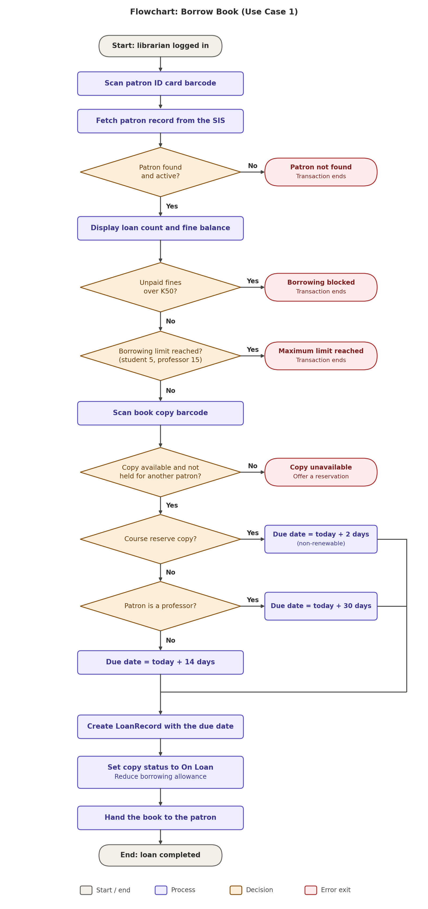
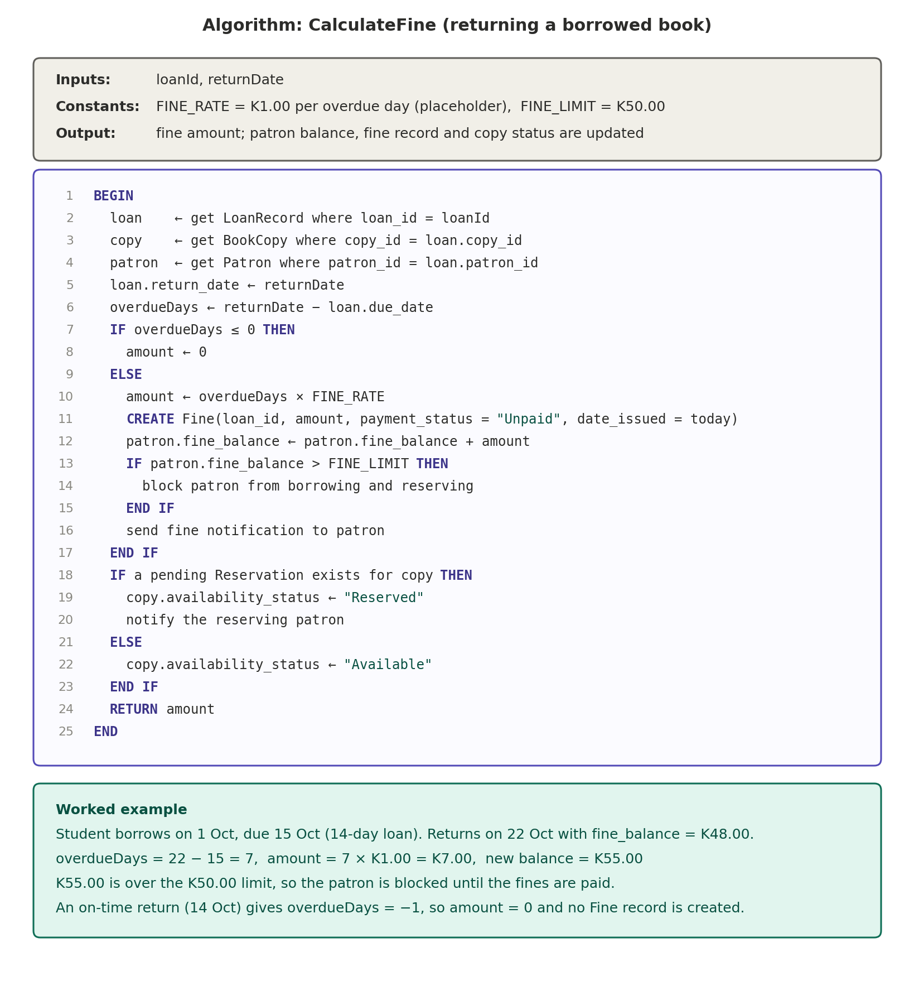
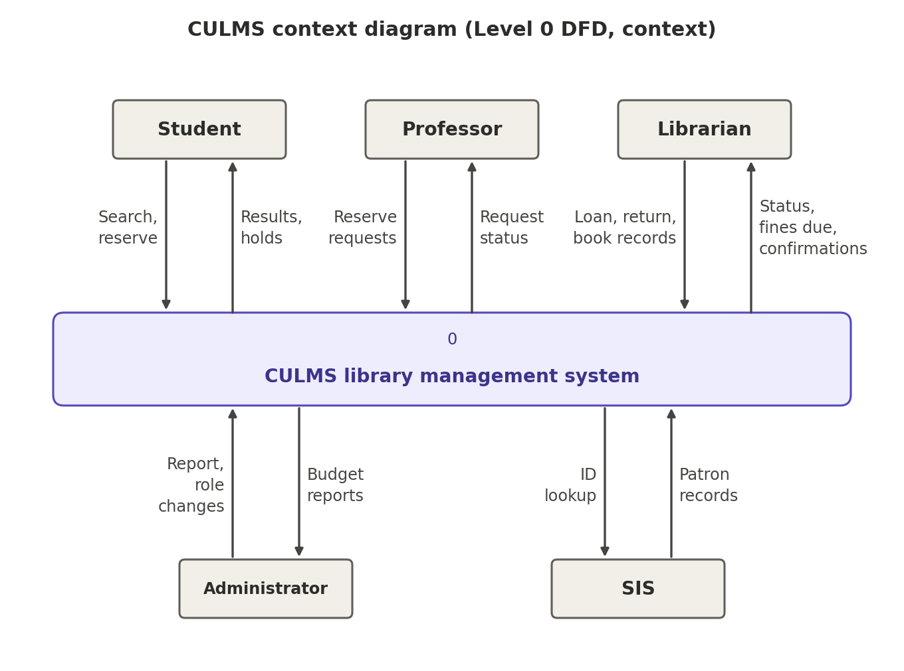
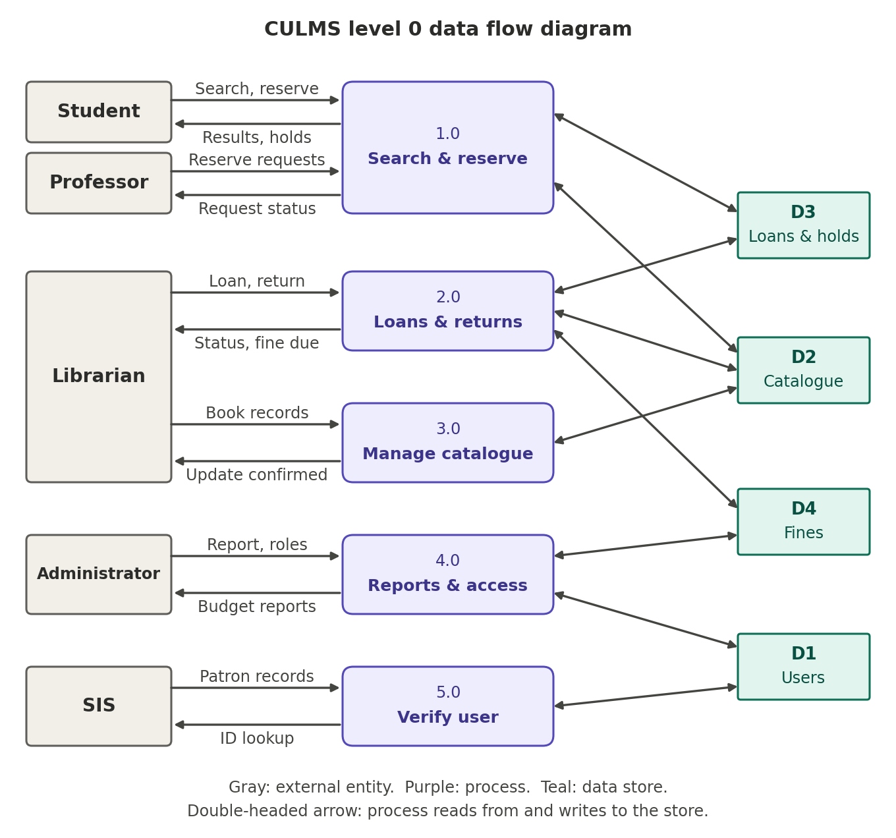
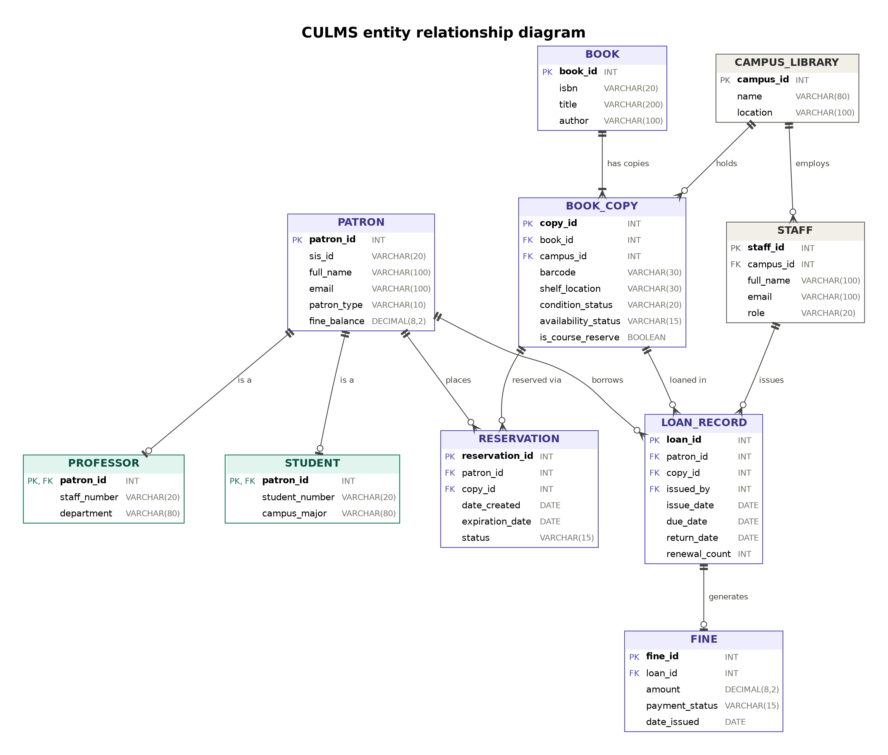

# CULMS - Copperbelt University Library Management System

A browser-based library management system concept for searching, borrowing and managing library resources across Copperbelt University campuses.

**Course:** IS 230 System Analysis and Design  
**Programme:** BSc in Information Systems  
**University:** The Copperbelt University, School of Information and Communication Technology  
**Group:** Group 2, The System Analysts

## Table of Contents

- [Overview](#overview)
- [Actors and Roles](#actors-and-roles)
- [Features and Status](#features-and-status)
- [Business Rules](#business-rules)
- [System Architecture](#system-architecture)
- [System Diagrams](#system-diagrams)
- [Technology Stack](#technology-stack)
- [Project Structure](#project-structure)
- [Getting Started](#getting-started)
- [Deployment](#deployment)
- [Roadmap](#roadmap)
- [Team](#team)
- [Credits and Licence](#credits-and-licence)

## Overview

Many library activities are traditionally recorded manually. Borrowing records and fine calculations can be delayed, while members have limited access to catalogue and account information outside the library.

CULMS is designed as a digital, object-oriented library system for online catalogue search, reservations, loan management, automated fine handling, borrowing history and administrative reporting across multiple campus libraries. The current repository contains the responsive public-facing pages, the domain model, repositories, storage adapters and seeded demonstration data. The user-facing workflows and role-specific application screens remain planned work.

## Actors and Roles

| Actor | Goal |
| --- | --- |
| Student | Search, reserve and borrow library materials within student borrowing limits. |
| Professor | Access teaching and research materials with the higher professor loan allowance. |
| Librarian | Manage catalogue circulation, reservations, returns and fines for library users. |
| Library Administrator | Configure library policy, manage users and review operational reports. |

## Features and Status

| Feature | Description | Status |
| --- | --- | --- |
| Responsive public pages | Home, services, about and help desk pages with shared navigation and footer rendering. | Implemented |
| Template cleanup | CULMS branding and content are adapted from the Startup template; unused template sections and assets were removed. | Implemented |
| Domain model | Entities cover books and copies, students, professors, staff, loans, reservations, fines, notifications and settings. | Implemented |
| Data layer | Repositories, JSON serialization, date rehydration, schema metadata and storage adapters are available. | Implemented |
| Seeded demonstration data | Sample books, copies, patrons, staff, loans, reservations, fines, notifications and settings can populate storage. | Implemented |
| Catalogue search | Repository-level search supports title, author and ISBN text plus campus filtering; the public page search form is currently presentational. | Implemented |
| Business rules | Core eligibility checks and configurable settings exist in the data model; complete use-case services for borrowing, renewals, reservations and fines are planned. | Planned |
| Login and authentication | A login placeholder page exists, but authentication and session handling are not implemented. | Planned |
| Role-specific screens | Student, professor, librarian and administrator workflows are planned. | Planned |
| Borrowing history and reporting | Loan data structures exist; user history views and administrator reports are planned. | Planned |
| Backend and shared database | The project currently uses browser storage and has no backend or shared server database. | Planned |

## Business Rules

| Rule | Definition |
| --- | --- |
| Student borrowing | Students may borrow up to 5 books for 14 days. |
| Professor borrowing | Professors may borrow up to 15 books for 30 days. |
| Fine restriction | Borrowing is blocked when unpaid fines exceed K50. |
| Course reserves | Course-reserve loans last 2 days and are non-renewable. |
| Reservations | Reservations expire after 7 days. |
| Fine rate | The fine rate is an administrator-configurable setting, currently defaulting to K2 per day. This default is an assumption until confirmed by the team. |

The entity and settings model represents several of these values. Enforcement across complete user workflows is part of the planned business layer.

## System Architecture

CULMS is organized around three layers:

- **Presentation layer:** The browser-facing boundary containing HTML pages and shared layout and interaction scripts.
- **Business layer:** The control layer intended for use-case services, validation and borrowing rules.
- **Data layer:** The entity and persistence layer containing domain objects, repositories, seed data and storage adapters.

The dependency rule is that presentation imports business only, business imports data only, and data imports nothing above it. This keeps responsibilities separated, supports maintainability and makes a later migration to TypeScript and React easier. The current presentation scripts primarily render the static site shell, while the business folder is reserved for the planned control logic.

## System Diagrams

### Process Flow

The borrowing flowchart describes the proposed sequence for checking a member, finding an available copy, issuing a loan and handling the borrowing decision. It relates the planned business workflow to the existing patron, book-copy and loan entities.



*Figure 1. Proposed borrowing process flow.*

The fine algorithm describes the proposed calculation and restriction path for overdue items and outstanding balances. The current data layer stores fines and calculates overdue days, while complete fine processing is planned.



*Figure 2. Proposed fine calculation algorithm.*

### Data Flow

The context diagram shows CULMS as the central system and its interactions with library members, librarians, administrators and the wider library environment.



*Figure 3. CULMS context-level view.*

The level 0 data flow diagram decomposes the system into major processes and data stores, showing how catalogue, member, circulation and administrative information is expected to move through CULMS.



*Figure 4. CULMS level 0 data flow diagram.*

### Data Model

The entity relationship diagram shows the principal records and relationships needed for patrons, staff, books, copies, loans, reservations and fines. It corresponds to the classes and repository collections implemented in the data layer.



*Figure 5. CULMS entity relationship diagram.*

## Technology Stack

- HTML5 for the static page structure.
- CSS3 and Bootstrap 5 for styling and responsive layout.
- JavaScript using ES modules for presentation and data-layer code.
- Browser `localStorage` as the data store, with an in-memory adapter for tests and fallback use. There is no backend.
- Static-file hosting on Vercel.
- Planned migration to TypeScript and React after the current JavaScript implementation matures.

The site also uses jQuery, Font Awesome, Bootstrap Icons, WOW.js, animate.css, Counter-Up, jQuery Easing and Waypoints in the existing template-based pages.

## Project Structure

The following tree reflects the repository contents relevant to the application. Hidden folders and generated dependency folders are omitted.

```text
CULMS/
├── about.html                 # About page and displayed loan-rule information
├── contact.html               # Help desk page and contact form shell
├── index.html                 # Public landing page
├── login.html                 # Login placeholder page
├── service.html               # Library services page
├── package.json               # Node test script and ES module setting
├── css/
│   ├── bootstrap.min.css      # Local Bootstrap stylesheet
│   └── style.css              # CULMS and template styles
├── diagrams/
│   ├── 01_culms_context_diagram.png
│   ├── 02_culms_level0_dfd.png
│   ├── 03_culms_borrow_book_flowchart.png
│   ├── 04_culms_erd.png
│   ├── 05_culms_fine_algorithm.png
│   ├── My project.PDF         # Diagram source/export document
│   ├── advanced.html          # Diagram viewing/export support file
│   └── image.html             # Diagram viewing/export support file
├── docs/
│   ├── ARCHITECTURE.md        # Layer and UML mapping notes
│   └── TEMPLATE-NOTES.md      # Retained and removed template details
├── icons/                     # CBU logo asset
├── img/                       # Site image assets
├── js/
│   ├── business/              # Reserved business/control layer
│   ├── data/                  # Entities, repositories, storage and seed data
│   └── presentation/          # Shared layout and browser presentation scripts
├── lib/                       # Local animation, easing, counter and waypoint libraries
└── tests/
    └── data/                  # Node tests for the data layer
```

## Getting Started

1. Clone or download the repository and open the `CULMS` folder.
2. Serve the folder with a simple static server. In VS Code, use Live Server, or run:

   ```bash
   npx serve .
   ```

3. Open the local URL printed by the server and navigate through the public pages.

Run the automated tests with the built-in Node test runner:

```bash
npm test
```

The browser stores CULMS data in its own `localStorage` namespace. A new browser profile is seeded with sample data, and data is therefore per-browser rather than shared between users or devices.

## Deployment

The project can be deployed on Vercel's free tier as a static site:

1. Push the CULMS project to a GitHub repository.
2. In Vercel, import the GitHub repository.
3. Select the framework preset **Other**.
4. Leave the build command empty.
5. Set the output directory to the project root, where the HTML files are located.
6. Deploy the project.

Because the application uses browser `localStorage` and has no backend, each browser has its own independent data. A Vercel deployment does not create a shared library database.

## Roadmap

1. [x] Clean up the starter template and apply CULMS branding.
2. [x] Build the domain model and data layer.
3. [ ] Build the business layer and enforce borrowing, reservation and fine rules.
4. [ ] Build the application shell and working login flow.
5. [ ] Build student and professor screens.
6. [ ] Build librarian screens.
7. [ ] Build administrator screens and reports.
8. [ ] Polish accessibility, content and responsive interactions.
9. [ ] Deploy the static release to Vercel.
10. [ ] Migrate the application to TypeScript and React later.

## Team

| Team member | Assigned analysis tasks |
| --- | --- |
| Ruth Mulenga | Executive Summary and Critical Reflection |
| Lukwesa Khondowe | OO Concept Justification and Team Contribution |
| Sande Mukosha | Use Case Model and Class Diagram |
| Namakau Moto | Relationship Analysis and Critical Reflection |
| Chishibe Kabwe | Process Recommendation |
| Mandla Peme | Noun-Verb Method |


